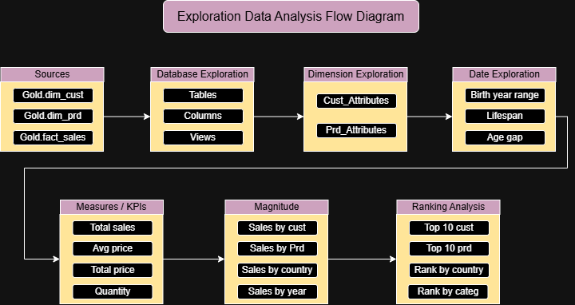

# 🔍 SQL Exploratory Data Analysis (EDA) Project

Welcome to the **SQL Exploratory Data Analysis Project**. This project explores the **Gold Layer** of my [Data Warehouse & Analytics Project](https://github.com/nagarakash014-png/sql-data_warehouse-project) using pure T-SQL. It walks through a structured EDA workflow, from understanding the database and its dimensions to calculating KPIs, measuring magnitude, and ranking top and bottom performers.

---

## 🎯 Project Objectives

- **Database Exploration**: Understand the structure, dimensions, and date range of the data.
- **Measures & KPIs**: Calculate key business metrics such as total sales, quantity, average price, and order counts.
- **Magnitude Analysis**: Compare measures across dimensions such as country, gender, category, and customer.
- **Ranking Analysis**: Identify top and bottom performing products, categories, and customers.
- **Business Insights**: Turn raw warehouse data into answers that support data-driven decisions.

---

## 🔄 Analysis Workflow

The project follows a step-by-step EDA approach, where each stage builds on the previous one:

```
+-------------------+     +---------------------+     +-------------------+
| Dimension         | --> | Date & Time         | --> | Measures          |
| Exploration       |     | Exploration         |     | Exploration       |
+-------------------+     +---------------------+     +-------------------+
                                                                |
                                                                v
                          +---------------------+     +-------------------+
                          | Ranking & Top N     | <-- | Magnitude         |
                          | Exploration         |     | Exploration       |
                          +---------------------+     +-------------------+
```

### Flow Diagram



The editable version of the diagram is available in [`Docs/flow_diagram.drawio`](Docs/flow_diagram.drawio).

---

## 📂 Repository Structure

```
├── Database Exploration/
│   ├── Dimenson Exploration.sql
│   ├── Date & Time Exploration.sql
│   ├── Measures Exploration.sql
│   ├── Mangnitude Exploration.sql
│   └── Ranking N  Top Exploration.sql
├── Docs/
│   ├── flow_diagram.drawio
│   └── flow_diagram.png
├── README.md
└── LICENSE
```

---

## 🧭 Analysis Modules

### 1. Dimension Exploration
📄 [`Dimenson Exploration.sql`](Database%20Exploration/Dimenson%20Exploration.sql)

- Explores the distinct values in the customer and product dimensions.
- Identifies the countries customers come from, and the categories, sub-categories, and product names available.
- Helps you understand how the data can be sliced and grouped later.

### 2. Date & Time Exploration
📄 [`Date & Time Exploration.sql`](Database%20Exploration/Date%20%26%20Time%20Exploration.sql)

- Finds the first and last order dates to determine the time span of the data.
- Calculates the range of the sales history in years or months.
- Identifies the youngest and oldest customers based on birth date.

### 3. Measures Exploration
📄 [`Measures Exploration.sql`](Database%20Exploration/Measures%20Exploration.sql)

- Calculates the key business KPIs from the sales fact table:
  - Total Sales
  - Average Sales
  - Total Quantity
  - Total Price and Average Price
  - Total Number of Orders, Products, and Customers
- Consolidates the metrics into a single business report.

### 4. Magnitude Exploration
📄 [`Mangnitude Exploration.sql`](Database%20Exploration/Mangnitude%20Exploration.sql)

- Compares measures across dimensions to understand the size and distribution of the business.
- Analyzes sales performance across:
  - Customers
  - Products
  - Categories and sub-categories
  - Years

### 5. Ranking & Top N Exploration
📄 [`Ranking N  Top Exploration.sql`](Database%20Exploration/Ranking%20N%20%20Top%20Exploration.sql)

- Ranks countries by sales and revenue.
- Identifies the top-performing products and the worst-performing ones.
- Ranks categories by revenue.
- Identifies the top customers by revenue.
- Uses window functions such as `RANK()`, `DENSE_RANK()`, and `ROW_NUMBER()`, along with `TOP N`.

---

## 🗄️ Data Source

This project queries the **Gold Layer (Star Schema)** built in the [Data Warehouse project](https://github.com/nagarakash014-png/sql-data_warehouse-project):

| **Table**         | **Type**  | **Description**                                              |
| ----------------- | --------- | ------------------------------------------------------------ |
| `gold.dim_cust`   | Dimension | Customer details with demographic and geographic data.       |
| `gold.dim_prd`    | Dimension | Product details with category hierarchy and maintenance info.|
| `gold.fact_sales` | Fact      | Sales transactions linked to customers and products.         |

> 💡 To run these scripts, you first need to build the data warehouse from the linked project.

---

## 🚀 How to Run

1. Set up the Data Warehouse by following the steps in the [Data Warehouse project](https://github.com/nagarakash014-png/sql-data_warehouse-project).
2. Clone this repository:
   ```bash
   git clone https://github.com/nagarakash014-png/sql-Exploration-Data-Analysis-project.git
   ```
3. Open the scripts in **SQL Server Management Studio (SSMS)**.
4. Run the scripts in the following order:
   1. `Dimenson Exploration.sql`
   2. `Date & Time Exploration.sql`
   3. `Measures Exploration.sql`
   4. `Mangnitude Exploration.sql`
   5. `Ranking N  Top Exploration.sql`

---

## 🛠️ Technologies Used

- **SQL (T-SQL)**: Querying, aggregation, window functions, and analytical logic.
- **SQL Server / SSMS**: Database engine and query environment.
- **Draw.io**: Flow diagram of the analysis process.
- **Git & GitHub**: Source control and documentation.

---

## 💡 Key SQL Concepts Practiced

- Aggregate functions (`SUM`, `AVG`, `COUNT`, `MIN`, `MAX`)
- `GROUP BY` and `ORDER BY`
- Joins between fact and dimension tables
- Date functions (`DATEDIFF`, `YEAR`, `GETDATE`)
- Window functions (`RANK`, `DENSE_RANK`, `ROW_NUMBER`)
- Subqueries and `TOP N` filtering
- `UNION ALL` for consolidated KPI reports

---

## 👨‍💼 About Me

I am an aspiring Business Analyst focused on turning data into insights that support better business decisions. This project, together with my Data Warehouse project, demonstrates my hands-on skills in SQL, data exploration, KPI development, and analytical thinking.

📫 **GitHub**: [nagarakash014-png](https://github.com/nagarakash014-png)

---

## 📄 License

This project is licensed under the **MIT License**. See the [`LICENSE`](LICENSE) file for details.
